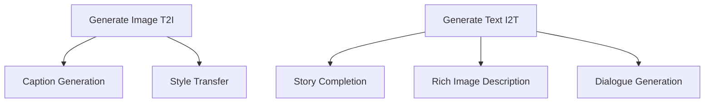
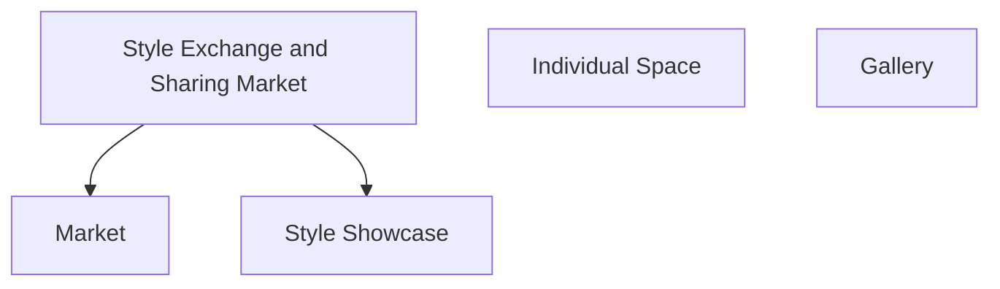

# 易炼（AlchemyAIGC)——基于创作风格交换的AIGC社交平台

> 该项目的核心创新点是可以用户可以提取作品的风格并与其他用户交换，将AI创作与社交交互相结合
>
> 1. 生成图像（T2I）
>    * 文生图
>    * 风格化图片
> 2. 生成文本 (I2T)
>    * 补全故事
>    * 丰富的图像描述
>    * 对话生成
> 3. 风格交换分享的 (market)
>    * 市场
>    * 风格展示
> 4. 个人空间 (Individual space)
> 5. 画廊 (Gallery)

## 项目背景

 

## 搭载的模型

### 文生图

* T2I-adpter版本的stable diffusion

### 图生文

* image caption模型

## 功能需求

```mermaid
graph TD;
    A[访客] -->|浏览网站| B(用户);
    B -->|使用功能| C(系统);
    C -->|生成图像(T2I)| D(模型);
    C -->|生成文本(I2T)| E(模型);
    C -->|风格交换分享(market)| F(模型);
    B -->|创建个人空间| G(系统管理员);
    B -->|上传图像或文本| H(系统管理员);
    B -->|评论或点赞| I(系统管理员);
    B -->|参加画廊展览| J(系统管理员);

```







### 主页（Main Page）

* 展示美丽的大屏给用户一个好印象
* 分栏展示几个小贴示，内容为如何使用我们的aigc功能
* 可以通过分栏跳转到用户感兴趣的地方

### 登录(Login)

* 输入用户名和密码即可登录
* 登录后个人空间可以使用否则不可以使用

### 个人空间(Self-Space)

* 项目栏：用户选择保存的创作都将分栏呈现
* 收藏夹：用户收藏的风格都会分栏呈现

### T2I创作(T2I creator)

* 接受用户输入的文字生成图片
  * 将文字传给后端
  * 在等待后端传回结果时会显示
  * 接收后端传回的结果
* 可以保存创作结果
  * 可以保存风格变量

### I2T创作(I2T creator)

* 接受用户上传的图片
  * 将文字传给后端
  * 在等待后端传回结果时会显示
  * 接收后端传回的结果
* 可以保存创作结果
  * 可以保存风格变量

### 故事创作（Story Maker)

* 接受用户输入的文字与提示
  * 将文字传给后端
  * 在等待后端传回结果时会显示
  * 接收后端传回的结果
* 可以保存创作结果
  * 可以保存风格变量

### 画廊与风格市场（Gallery&Market）

* 分栏呈现目前最好的用户创作
* 可以获取具体的创作风格

## 数据需求

### 登录页面

* 数据规约
  | 数据名   | 说明   | 数据类型    |
  | -------- | ------ | ----------- |
  | userName | 用户名 | VARCHAR(30) |
  | password | 密码   | INT(20)     |

* 示例

  ```json
  {
      "userName": "Yiming Huang"，
      "password":	"iras17504"
  }
  ```


## 原型设计

* 主页（MainPage Ideas&Tips）

  

* 用户登录页面 （Login）

  

* 个人空间（Individual Space）

  

* T2I创作

  

* I2T创作

  

* 画廊（Gallery&Markert)

  

* 跳转逻辑设计入下图所示

  

## 开发过程记录（draft）

### 前端

* 主页

  


* 登录界面

  

* 跳转逻辑，由router主要实现

  ```js
  import Vue from 'vue'
  import VueRouter from 'vue-router'
  import Home from '../views/Home.vue'
  
  Vue.use(VueRouter)
  
  const routes = [
      {
          path: '/',
          name: 'Home',
          component: Home
      },
      {
          path: '/category',
          name: 'Category',
          component: () => import("@/views/Category.vue"),
      },
      {
          path: '/detail',
          name: 'Detail',
          component: () => import("@/views/Detail.vue"),
      },
      {
          path: '/authors',
          name: 'Authors',
          component: () => import("@/views/Authors.vue"),
      },
      {
          path: '/login',
          name: 'Login',
          component: () => import("@/views/Login.vue"),
      }
  ]
  
  const router = new VueRouter({
      routes,
      scrollBehavior() {
          document.getElementById('app').scrollIntoView();
      }
  })
  
  export default router
  
  ```

  ### ***\*4. 1\*******\*主页（Main\**** ***\*Page\*******\*）\****
  
  · 展示美丽的大屏给用户一个好印象，吸引用户留意到网站的存在。
  
  · 分栏展示几个小贴示，内容为如何使用我们的aigc功能，方便用户快速上手了解如何使用。
  
  · 可以通过分栏跳转到用户感兴趣的地方，方便用户快速进入他们需要的功能页面。
  
  ### ***\*4.2\*******\*登录(Login)\****
  
  · 输入用户名和密码即可登录，保证用户的个人信息安全。
  
  · 登录后个人空间可以使用，否则不可以使用。用户可以在个人空间中保存自己的作品以及收藏喜欢的风格。
  
  ### ***\*4.3\**** ***\*个人空间(Self-Space)\****
  
  · 项目栏：用户可以在此选择保存的创作，方便管理和查找。
  
  · 收藏夹：用户可以在此查看和管理自己收藏的风格。
  
  ### ***\*4.4\**** ***\*T2I创作(T2I creator)\****
  
  · 接受用户输入的文字生成图片，用户可以通过输入文字的方式，快速生成自己想要的图片。
  
  · 将文字传给后端，后端会处理文字并返回相应的图片。
  
  · 在等待后端传回结果时会显示loading页面，让用户知道系统正在处理中。
  
  · 接收后端传回的结果，用户可以查看创作的结果，并保存创作结果。
  
  · 可以保存创作结果，用户可以将自己的作品保存在个人空间中，以供查看和分享。
  
  · 可以保存风格变量，方便下次再次使用相同的风格。
  
  ### ***\*4.5 I\*******\*2T创作(I2T creator)\****
  
  · 接受用户上传的图片，用户可以通过上传自己的图片，快速生成相应的文字描述。
  
  · 将图片传给后端，后端会处理图片并返回相应的文字描述。
  
  · 在等待后端传回结果时会显示loading页面，让用户知道系统正在处理中。
  
  · 接收后端传回的结果，用户可以查看创作的结果，并保存创作结果。
  
  · 可以保存创作结果，用户可以将自己的作品保存在个人空间中，以供查看和分享。
  
  · 可以保存风格变量，方便下次再次使用相同的风格。